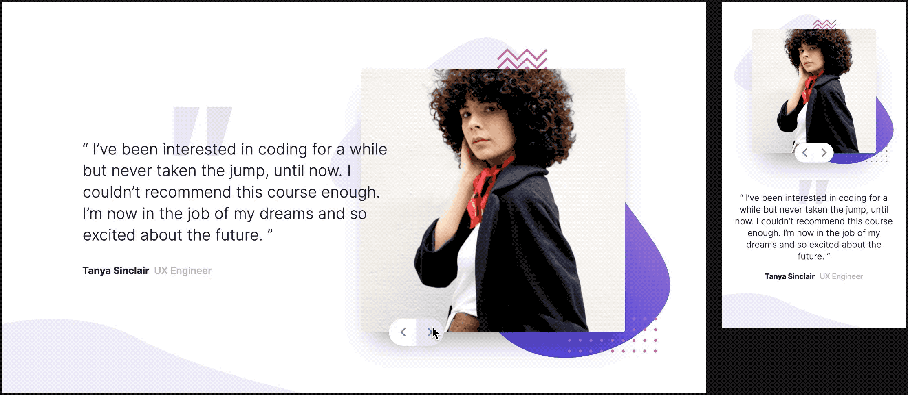

# Frontend Mentor - Coding Bootcamp Testimonials Slider

A Testimonials Slider react component

This is a React refactor of my initial submission (HTML/CSS/JS to the [_Coding bootcamp testimonials slider_ challenge on Frontend Mentor](https://www.frontendmentor.io/challenges/coding-bootcamp-testimonials-slider-4FNyLA8JL).

## Table of contents

- [Overview](#overview)
  - [The challenge](#the-challenge)
  - [Links](#links)
- [My process](#my-process)
  - [Built with](#built-with)
  - [What I learned](#what-i-learned)
  - [Continued development](#continued-development)
  - [Useful resources](#useful-resources)
- [Author](#author)

## Overview

### The challenge

This slider component's design included a mobile and desktop view and needed a graceful way for the desktop view to scale down.

The component defaults to the mobile view and accepts _large_ boolean prop. I also added faint click sounds with the [useSound](https://github.com/joshwcomeau/use-sound) hook.

### Links

- Solution: [https://www.frontendmentor.io/solutions/coding-bootcamp-testimonials-slider-QC5h4Tday](https://www.frontendmentor.io/solutions/coding-bootcamp-testimonials-slider-QC5h4Tday)
- Live Site: [https://testimonials-slider-astroud.vercel.app/](https://testimonials-slider-astroud.vercel.app/)

## My process

### Built with

- [React](https://reactjs.org/)
- [Styled Components](https://styled-components.com/)
- [React Transition Group](http://reactcommunity.org/react-transition-group/)
- [useSound](https://github.com/joshwcomeau/use-sound)

### What I learned

This project gave me the opportunity to work more with [Styled Components](https://styled-components.com/) and was my first experience with [React Transition Group](http://reactcommunity.org/react-transition-group/).

### Useful resources

- [What the heck, z-index??](https://www.joshwcomeau.com/css/stacking-contexts/) - This Josh Comeau helped me better understand the stacking order of HTML elements with `z-index`.
- [The styled-components Happy Path](https://www.joshwcomeau.com/css/styled-components/) - This Josh Comeau article convinced me to try out Styled Components. I didn't refer to it for this project but I highly recommend it.
- [Additional notes](https://github.com/astroud/notes/blob/main/Converting%20html-css%20projects%20to%20React.md) - Additional notes from refactoring HTML/CSS/JS FEM challenges.

## Author

- Website - [Aaron Stroud](https://aaronstroud.com)
- Frontend Mentor - [@astroud](https://www.frontendmentor.io/profile/astroud)
- Twitter - [@aaron_stroud](https://www.twitter.com/aaron_stroud)
